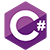

# Shipfinity 🛍️
A collaborative group projects by the members of G1 at the SEDC programming academy. This is a full-stack web store application. Using C# ASP.NET web api as a back-end to serve an angular front-end application via a RESTful api.

  

## Features ⚡
- Entity Framework Core: The application uses Entity Framework Core as the ORM to interact with the underlying database.
- Repository Pattern: The application follows the repository pattern to separate data access logic from business logic.
- Responsive UI: The application provides a responsive user interface in angular using Bootstrap.
- ASP.NET MVC app as an Administrator page.

## Usage 🖥️
### Prerequisites 📦
- .NET Core 6.0
- SQL Server (or any other supported database) installed and configured
- node.js 18 or later
- Angular 16

### Installation ⚙️
1. Clone the repository: `git clone https://github.com/KristijanJankuloski/Shipfinity.git`
2. Open in preferred IDE
3. Configure project
4. Update database from migrations
5. Start api application
6. Start angular application with `ng serve` or `npm run dev`

### Configuration 💾
- Update connection string in `appsettings.json`
- Update base api url for angular project in `environment` `BASE_API_URL`
